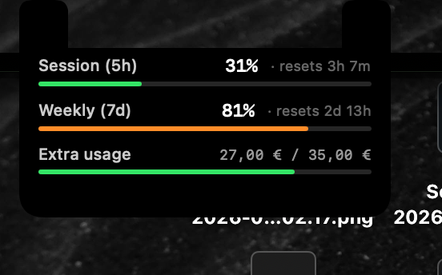

# Claude Token Island

A lightweight macOS app that shows your [Claude.ai](https://claude.ai) plan usage right under your MacBook's notch — a Dynamic-Island-style pill you tap to expand, no browser needed.



## What it shows

- **Collapsed:** a small pill flush under the notch showing your live 5-hour session usage — a percentage and a colored bar.
- **Expanded (tap it):** the notch grows into an island with the full breakdown:
  - **Session (5h)** — current 5-hour window, with time until reset. Once you hit 100% *and* extra usage is on, this shows your live credit spend (in euros) instead of a flat "100%", so the number stays informative.
  - **Weekly (7d)** — weekly all-models usage, with time until reset
  - **Extra usage** — whether pay-as-you-go credits are enabled (**On/Off**), plus euros spent vs. your monthly cap when on. Its bar is green/orange/red by utilization when on, gray when off.

Bars are green normally, orange from 80%, red from 90%. Data mirrors `claude.ai/settings/usage`.

## Interaction

- **Tap** the pill to expand; tap again, click anywhere else, or wait ~4s (hovering pauses the countdown) to collapse.
- **Gear** (top-right of the expanded island) opens a small settings popover: refresh interval, a manual refresh, and quit.

## Requirements

- macOS 13+, a MacBook **with a notch**
- [Claude Code](https://claude.ai/code) installed and logged in — the app reads its OAuth token from your Keychain, so there are no separate credentials to enter.

## Build from source

Uses [XcodeGen](https://github.com/yonaskolb/XcodeGen) (`brew install xcodegen`). The Xcode project is generated from `project.yml`; regenerate with `xcodegen generate` after editing it.

```bash
git clone https://github.com/ettoknospe/ClaudeTokenIsland
cd ClaudeTokenIsland/ClaudeTokenIsland
xcodegen generate            # if the .xcodeproj isn't present / project.yml changed
xcodebuild -scheme ClaudeTokenIsland -configuration Release build
```

Or open `ClaudeTokenIsland.xcodeproj` in Xcode and run with ⌘R.

## Install & run at login

```bash
# copy the built app into /Applications
cp -R ~/Library/Developer/Xcode/DerivedData/ClaudeTokenIsland-*/Build/Products/Release/ClaudeTokenIsland.app /Applications/
open /Applications/ClaudeTokenIsland.app
```

On first launch macOS asks permission to read the Claude Code Keychain item — click **Always Allow** (once, since the app now lives in a fixed location).

To start it automatically: **System Settings → General → Login Items → +**, and add `ClaudeTokenIsland`.

## How it works

The app reads your Claude Code OAuth token from the macOS Keychain (`Claude Code-credentials`) and calls the same internal endpoint that powers `claude.ai/settings/usage`:

```
GET https://api.anthropic.com/api/oauth/usage
Authorization: Bearer <oauth_token>
anthropic-beta: oauth-2025-04-20
```

The token is cached in memory and re-read from the Keychain automatically if a request comes back unauthorized. On a rate-limit (`429`) it backs off and retries after 15 minutes.

> **Note:** This endpoint is undocumented and may change. It requires Claude Code to be installed and logged in.

## Running tests

```bash
xcodebuild test -project ClaudeTokenIsland.xcodeproj \
  -scheme ClaudeTokenIslandTests \
  -destination 'platform=macOS'
```

## License

MIT
